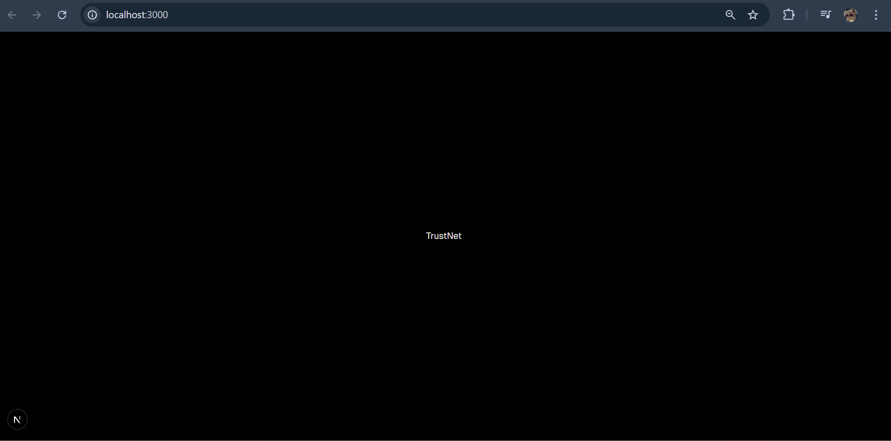
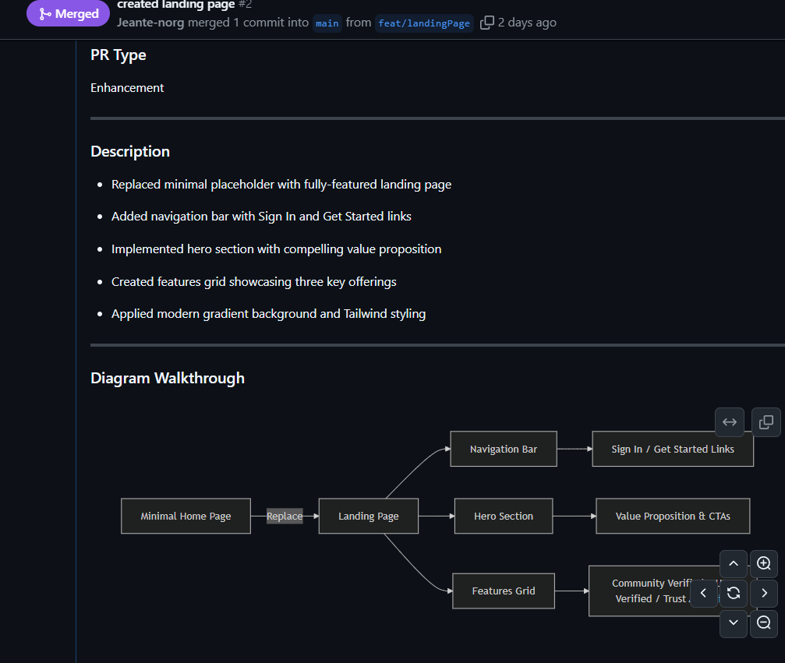
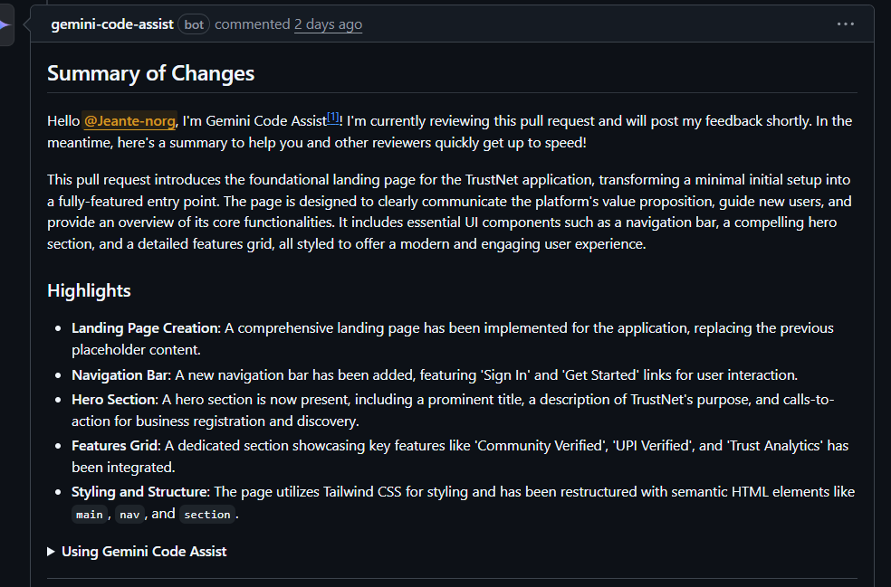
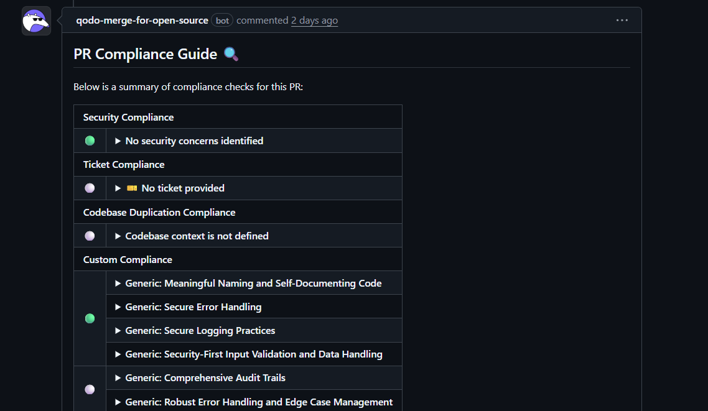
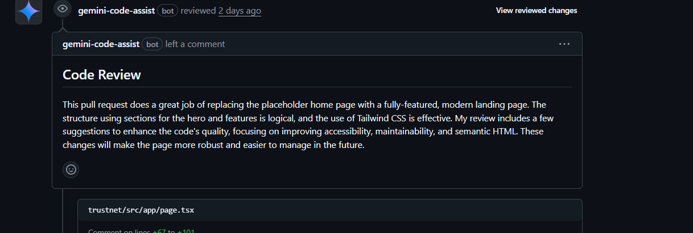
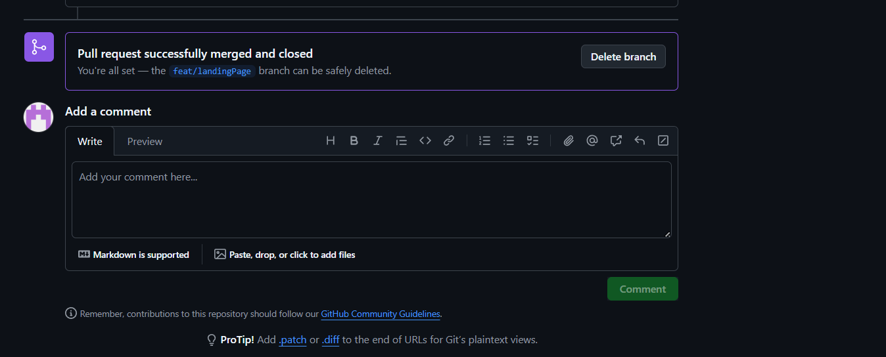

# TrustNet – Lightweight Digital Identity Verification for Local Businesses

TrustNet empowers small-scale entrepreneurs and local businesses by giving them credible, verified digital identities. Traditional Know-Your-Customer (KYC) processes are too document-heavy for micro-businesses, street vendors, and home-based entrepreneurs. TrustNet solves this by offering community validation, UPI transaction-based trust signals, and analytics that help local entrepreneurs build and showcase their credibility online.

---

## 📁 Folder Structure

```
TrustNet/
│
├── app/
│   ├── page.tsx                 → Home page (frontend UI)
│   ├── dashboard/
│   │   └── page.tsx             → Dashboard view for business insights
│   └── api/
│       ├── users/
│       │   └── route.ts         → API endpoint for user management
│       ├── auth/
│       │   └── route.ts         → OTP-based authentication API
│       └── business/
│           └── route.ts         → Business profile CRUD operations
│
├── components/
│   ├── Navbar.tsx               → Top navigation bar component
│   ├── Footer.tsx               → Footer component
│   ├── BusinessCard.tsx         → Displays business details and trust score
│   └── AnalyticsChart.tsx       → Chart.js component for analytics dashboard
│
├── lib/
│   ├── db.ts                    → Database connection logic (PostgreSQL)
│   ├── auth.ts                  → Authentication and session utilities
│   ├── trustScore.ts            → Core logic for trust score calculation
│   └── redis.ts                 → Redis caching configuration
│
├── public/
│   └── logo.png                 → Project logo for README and UI
│
├── styles/
│   └── globals.css              → Global Tailwind CSS and style settings
│
├── .env.local                   → Environment variables (not committed)
├── next.config.js               → Next.js configuration
├── package.json                 → Dependencies and project metadata
└── README.md                    → Project documentation

```

---

## Setup and Installation

### 1. Prerequisites

- Node.js 20 or higher
- PostgreSQL 15 or higher
- Redis 7 or higher
- Docker (optional but recommended)
- AWS or Azure account for deployment

### 2. Installation

Clone the repository
git clone https://github.com/kalviumcommunityS62_1025_API-nauts_Full-Stack-With-NextjsAnd-AWS-Azure-Supply-Chain_TrustNet.git
cd trustnet

Install dependencies
npm install

Setup environment variables
cp .env.example .env

Add your database URL, Redis URL, and required environment keys
Run Prisma migrations
npx prisma migrate dev

Seed initial data (optional)
npx prisma db seed

### 3. Running Locally

Start the Next.js development server
npm run dev

Visit http://localhost:3000 to view the application.

### 4. Using Docker

Build and run containers
docker-compose up --build

---

## Reflection: Structural Design Rationale

The structure and technologies were chosen to maximize modularity, scalability, and performance across future sprints.

- Next.js 14 provides full-stack capabilities with built-in API routes, ensuring frontend and backend alignment.
- PostgreSQL with Prisma offers a robust ORM layer and easily maintainable schema evolution.
- Redis caching enhances performance for analytics and trust score computations.
- Docker ensures consistent development and production environments.

This structure supports collaborative scaling for future sprint pipelines where each subsystem (analytics, verification, dashboard) can evolve independently with minimal coupling.

---

## Screenshot

Add a screenshot of your local application running below.

Example placeholder:



---

## Future Enhancements

- Mobile app integration for field agents and vendors
- Advanced analytics with AI-driven trust prediction
- Multi-language support for vernacular inclusivity
- Integration with government micro-loan identity networks

---

## Contributors

| Role                | Team Member         | Key Responsibilities                                          |
| ------------------- | ------------------- | ------------------------------------------------------------- |
| Frontend Lead       | Claudia Jerome      | Next.js UI components, responsive design, analytics dashboard |
| Backend Lead        | Tejas Philip Thomas | Database design, API routes, UPI verification system          |
| Full-Stack & DevOps | Isaac Reji          | Prisma schema, Redis integration, Docker setup, deployment    |
| Quality Assurance   | All Members         | Testing, bug reporting, user experience validation            |

---

## Code Quality Configuration

### TypeScript

We enabled strict mode to catch potential issues early:

- `"strict": true` ensures all types are defined.
- `"noImplicitAny": true` prevents untyped variables.
- `"noUnusedLocals"` and `"noUnusedParameters"` clean up unused code.

### ESLint + Prettier

Our ESLint configuration extends `next/core-web-vitals` and Prettier rules to ensure clean, readable, and consistent code.
We enforce:

- No console logs in production.
- Mandatory semicolons.
- Double quotes for all strings.

### Husky + lint-staged

We use Husky and lint-staged to automatically lint and format code before commits.  
This ensures that no badly formatted code enters our repository.

### Example Output

When committing code that violates lint rules, Husky blocks the commit until all issues are fixed.

---

# Environment Variables Configuration for TrustNet Backend

This document explains the environment variables needed for the TrustNet backend, their purposes, client vs server safety, how to replicate the setup using `.env.example`, and common pitfalls avoided.

---

## Purpose of Each Environment Variable

| Variable          | Purpose                                                                         | Client-Side Safe?              |
| ----------------- | ------------------------------------------------------------------------------- | ------------------------------ |
| `DATABASE_URL`    | Connection string for the PostgreSQL database                                   | No (Server-side only)          |
| `JWT_SECRET`      | Secret key for signing JSON Web Tokens for user authentication                  | No (Server-side only)          |
| `NEXTAUTH_SECRET` | Secret used for NextAuth session encryption                                     | No (Server-side only)          |
| `REDIS_URL`       | Connection URL for Redis server used for caching and session storage            | No (Server-side only)          |
| `NODE_ENV`        | Defines environment mode (e.g., development, production)                        | No (Server-side only)          |
| `UPI_SERVICE_URL` | URL for UPI verification service (mock during dev, real endpoint in production) | No (Server-side only)          |
| `NEXTAUTH_URL`    | Public URL of the application, used by NextAuth for redirect callbacks          | Yes (safe to expose if needed) |

---

## Server-Side vs Client-Side Access

- All environment variables except `NEXTAUTH_URL` are **server-side only** and must not be exposed in client-side bundles.
- Ensure no sensitive variables have the `NEXT_PUBLIC_` prefix, as Next.js exposes those to the browser.
- Variables without `NEXT_PUBLIC_` prefix are accessible only in API routes and server code via `process.env`.
- This separation protects secrets like database URLs, JWT secrets, and Redis connections from client exposure.

---

## How to Replicate the Setup Using `.env.example`

1. Copy `.env.example` to `.env` in your project root.
2. Replace placeholder values with your actual credentials and secrets:
   - Update PostgreSQL connection string (`DATABASE_URL`)
   - Generate strong secrets for `JWT_SECRET` and `NEXTAUTH_SECRET`
   - Configure correct Redis connection URL (`REDIS_URL`)
   - Point `UPI_SERVICE_URL` to the appropriate service endpoint
   - Set `NEXTAUTH_URL` to your deployed application URL
3. Add `.env` to your `.gitignore` file to prevent committing sensitive secrets to version control.
4. Restart your development or production server after modifying `.env` to ensure all variables load correctly.
5. For deployment, use your cloud provider's environment variable configuration (AWS, Azure, Docker secrets, etc.) instead of local `.env`.

---

## Common Pitfalls Avoided

- **Exposing secrets accidentally**: No sensitive variables are prefixed with `NEXT_PUBLIC_`, avoiding client bundle exposure.
- **Not committing secrets**: The `.env.example` serves as a safe template only; the actual `.env` file is excluded from version control.
- **Quotation usage**: Values with special characters or URLs are wrapped in double quotes to avoid parsing errors.
- **Runtime accessibility**: Variables are accessed at runtime in server-side API routes, preventing build-time leakage.
- **Clear naming and documentation**: Variable names and comments make purpose and usage explicit, preventing misconfiguration.

---

This approach ensures secure and smooth configuration of environment variables for the TrustNet backend while easing setup for other developers.

---

## Development Workflow.

---

### Branch Naming Convention

### Format

{type}/{short-description}

### Types

- `feat/` - New features
- `fix/` - Bug fixes
- `hotfix/` - Critical production fixes
- `docs/` - Documentation updates
- `style/` - Code style changes (formatting, etc.)
- `refactor/` - Code refactoring
- `test/` - Adding tests
- `chore/` - Maintenance tasks

### Examples

- `feat/user-authentication`
- `fix/login-validation`
- `docs/api-endpoints`
- `refactor/auth-system`

### PR TEMPLATE

### Description

<!-- Describe your changes and what problem they solve -->

### Type of Change

- [ ] 🚀 New feature
- [ ] 🐛 Bug fix
- [ ] 📚 Documentation
- [ ] 🎨 Style update
- [ ] ♻️ Code refactor
- [ ] ✅ Test addition
- [ ] 🔧 Chore
- [ ] ⚠️ Breaking change

### Checklist

- [ ] My code follows the project style guidelines
- [ ] I have performed a self-review of my code
- [ ] I have commented my code where necessary
- [ ] I have updated the documentation if needed
- [ ] My changes generate no new warnings
- [ ] I have added tests that prove my fix is effective
- [ ] New and existing unit tests pass locally

### Workflow Reflection

This workflow helps because:

**Code Quality:**

- ESLint/Prettier catch issues early
- Code reviews catch bugs before merging
- Consistent patterns make code maintainable

**Collaboration:**

- Clear PR templates help reviewers understand changes
- Everyone follows same branching conventions
- CI/CD pipeline provides objective quality gates

**Velocity:**

- Automated checks save manual review time
- Clear processes reduce confusion and rework
- Quick feedback loops through CI pipeline

### Screenshots (if applicable)











🔧 Environment-Aware Build Setup

We created .env.development, .env.staging, and .env.production for each environment.
Secrets are securely stored using GitHub Secrets and injected via CI/CD pipelines.

Build scripts:

npm run build:dev → Local testing

npm run build:staging → Staging deployment

npm run build:production → Production deployment

Why this matters:
This setup ensures consistent deployments and protects sensitive credentials across environments.
No real secrets are ever committed to GitHub.

---

# Prisma Database Migrations and Seed Scripts

## Overview

This guide explains how to use Prisma ORM for database migrations and seed scripts to ensure all environments have a consistent database schema and initial data. It covers setup, migration management, seeding scripts, verifying data, and rollback safety.

## Setup

1. Ensure that **Prisma** and **PostgreSQL** are configured in your project.
2. Initialize Prisma:
      
   - npx prisma init

## Database Migrations

### Create and Apply First Migration

Generate migration files, apply them to the database, and update the Prisma Client:

   - npx prisma migrate dev --name init_schema

### Modify or Add a New Migration

To modify the schema or add a new table:

   - npx prisma migrate dev --name add_project_table


### Reset or Rollback Database

Reset the database, re-apply all migrations, and optionally re-run the seed script:

   - npx prisma migrate reset


## Seed Script

1. Create the file `prisma/seed.ts`:

import { PrismaClient } from '@prisma/client';
const prisma = new PrismaClient();

async function main() {
await prisma.user.createMany({
data: [
{ name: 'Alice', email: 'alice@example.com' },
{ name: 'Bob', email: 'bob@example.com' },
],
});
console.log('Seed data inserted successfully');
}

main()
.then(async () => await prisma.$disconnect())
.catch(async (e) => {
console.error(e);
await prisma.$disconnect();
process.exit(1);
});


2. Add the seed command to your `package.json`:

"prisma": {
"seed": "ts-node prisma/seed.ts"
}


3. Run the seed script:

   - npx prisma db seed


## Verify the Data

Use Prisma Studio to check that the seed data has been inserted:

   - npx prisma studio


## Rollback and Safety

- Always test all migrations locally before applying to production.
- Use backups and staging environments for safety.
- Treat migrations as version-controlled code; do not edit existing migrations after they’ve been applied in production.

## Sample output logs


## Database Schema

Our PostgreSQL schema enables core features:

**User Management**: Phone-based authentication with roles (Customer/Business Owner/Admin)

**Business** Profiles: Complete business info with trust scoring and multiple verification methods (phone, community, UPI)

**Trust System**: Reviews (1-5 stars), endorsements from community, and calculated trust scores

**UPI Integration**: Transaction pattern analysis without storing personal financial data

**Analytics**: Pre-computed metrics for fast dashboard performance

### Key Features

Privacy-first: Only aggregated UPI insights, no personal transaction data

Scalable design: CUID identifiers, proper indexing, cascade deletes

Multiple verification: Progressive trust building through different methods

Performance optimized: Indexed fields, efficient relationships

Quick Start

1. npm run db:generate # Generate Prisma client
2. npm run db:push # Update database schema
3. npm run db:seed # Add sample data
4. npm run db:studio # Database GUI
5. The schema supports TrustNet's mission of building digital credibility for local businesses through community-powered verification.
